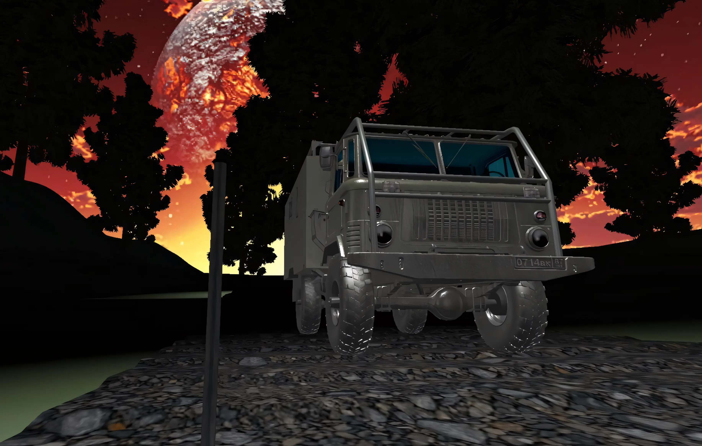
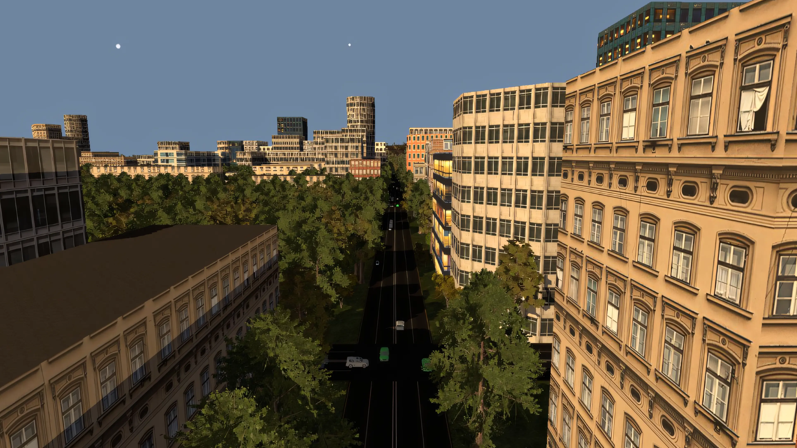

## Hi there 👋
### I do graphics programming
### Here are a few projects I've been a part of:  

TER (2022)            |  TMP (2023)
-------------------------|-------------------------
 Render overview:  <ul><li> C/OpenGL <li> Deffered rendering pipeline <li> Blinn-Phong lighting model <li> Team size: ~20 |  Render overview:  <ul><li> C++/Vulkan <li> Deffered rendering pipeline <li> Blinn-Phong lighting model <li> Culling and more compute shaders <li> Generally parallel <li> Team size ~10

Currently working on WIP renderer - [mr-graphics](https://github.com/4J-company/mr-graphics)  

#### Recent activity:
<!--START_SECTION:activity-->
1. 💪 Opened PR [#14](undefined) in [4J-company/mr-importer](https://github.com/4J-company/mr-importer)
2. 💪 Opened PR [#89](undefined) in [4J-company/mr-graphics](https://github.com/4J-company/mr-graphics)
3. 🚀 Published release [v1.1.2](https://github.com/4J-company/mr-utils/releases/tag/v1.1.2) in [4J-company/mr-utils](https://github.com/4J-company/mr-utils)
4. 🔒 Closed issue [#3](https://github.com/4J-company/mr-importer/issues/3) in [4J-company/mr-importer](https://github.com/4J-company/mr-importer)
5. 🚀 Published release [v2.8.1](https://github.com/4J-company/mr-importer/releases/tag/v2.8.1) in [4J-company/mr-importer](https://github.com/4J-company/mr-importer)
<!--END_SECTION:activity-->

#### Contact me here:
 - telegram: https://t.me/cgsg106
 - email:    mt6@4j-company.ru
