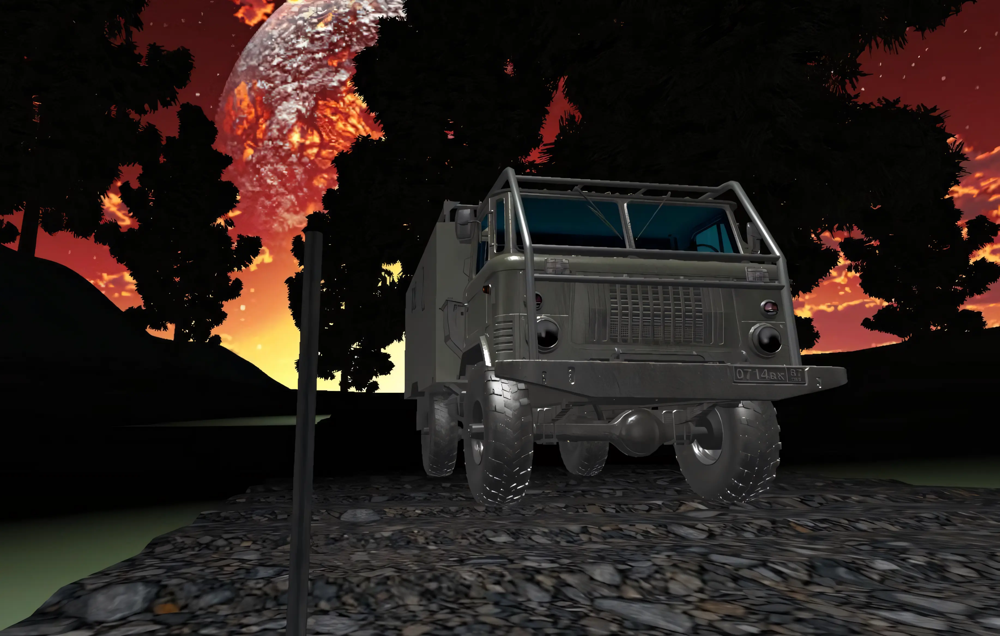
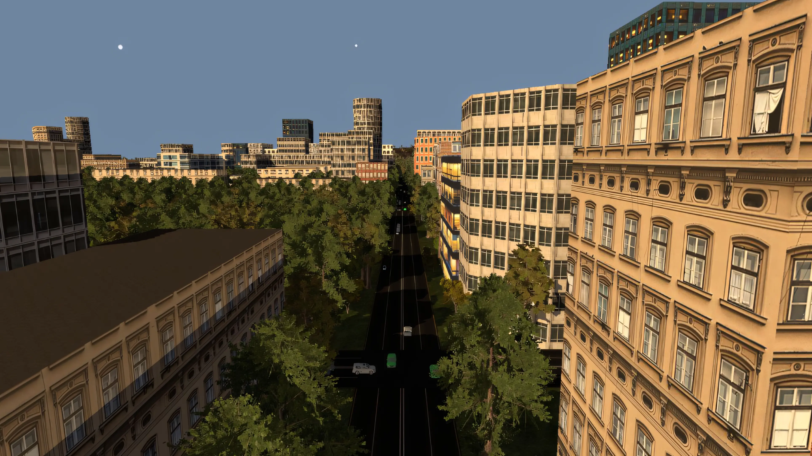

## Hi there 👋
### I do graphics programming
### Here are a few projects I've been a part of:  

TER (2022)            |  TMP (2023)
-------------------------|-------------------------
 Render overview:  <ul><li> C/OpenGL <li> Deffered rendering pipeline <li> Blinn-Phong lighting model <li> Team size: ~20 |  Render overview:  <ul><li> C++/Vulkan <li> Deffered rendering pipeline <li> Blinn-Phong lighting model <li> Culling and more compute shaders <li> Generally parallel <li> Team size ~10

Currently working on WIP renderer - [mr-graphics](https://github.com/4J-company/mr-graphics)  

#### Recent activity:
<!--START_SECTION:activity-->
1. 🚀 Published release [v3.3.0](https://github.com/4J-company/mr-importer/releases/tag/v3.3.0) in [4J-company/mr-importer](https://github.com/4J-company/mr-importer)
2. 🎉 Merged PR [#16](https://github.com/4J-company/mr-importer/pull/16) in [4J-company/mr-importer](https://github.com/4J-company/mr-importer)
3. 💪 Opened PR [#16](https://github.com/4J-company/mr-importer/pull/16) in [4J-company/mr-importer](https://github.com/4J-company/mr-importer)
4. 🎉 Merged PR [#9](https://github.com/AMCP-Drones/drones/pull/9) in [AMCP-Drones/drones](https://github.com/AMCP-Drones/drones)
5. 💪 Opened PR [#9](https://github.com/AMCP-Drones/drones/pull/9) in [AMCP-Drones/drones](https://github.com/AMCP-Drones/drones)
<!--END_SECTION:activity-->

#### Contact me here:
 - telegram: https://t.me/cgsg106
 - email:    mikhail.d.tsukanov@proton.me
